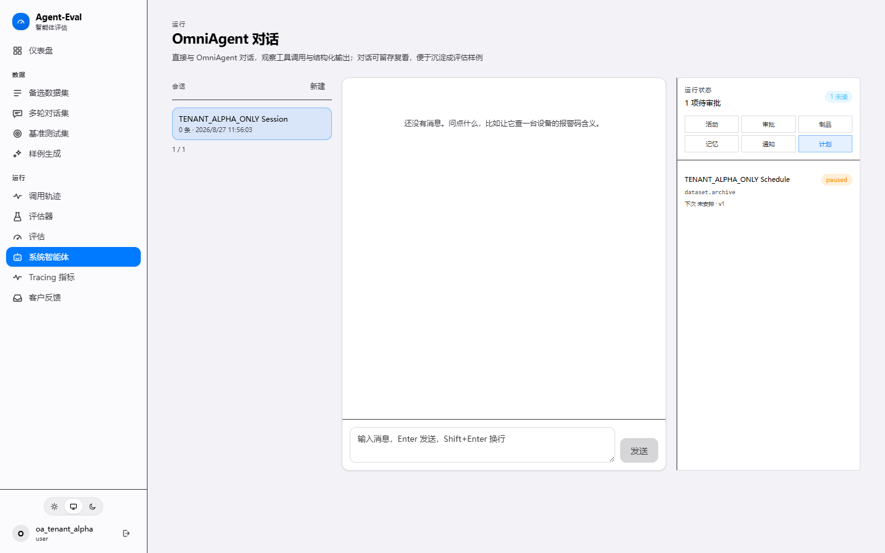

<div align="center">

# Agent Eval

**面向 AI Agent 的评估、回归测试与受控执行平台**

把分散的 Trace、测试集、LLM Judge 和人工复核，组织成可复现、可审计、可持续迭代的工程闭环。

`Python 3.11+` · `FastAPI` · `PostgreSQL` · `React 18` · `LangSmith` · `Langfuse` · `Kubernetes`

</div>

---

## 项目定位

Agent Eval 解决的不是“调用一次模型并展示分数”，而是 Agent 上线后更难的工程问题：

- 如何从真实 Trace 和标准数据集构建可版本化的测试资产；
- 如何同时评估答案、工具调用、推理过程、性能与错误恢复；
- 如何对单轮、多轮、图片输入和双模型 A/B 结果进行统一回归分析；
- 如何让 Agent 执行长任务，同时控制权限、租户边界、资源配额和产物生命周期。

项目包含两条相互衔接的主线：

| 主线 | 解决的问题 | 关键能力 |
|---|---|---|
| **Agent Evaluation Workbench** | Agent 的质量是否可度量、可比较、可回归？ | 数据集管理、Trace 导入、规则与 LLM Judge、单/多轮评估、A/B 对比、成本分析、报告导出 |
| **Governed OmniAgent** | Agent 如何安全地执行有状态、长耗时任务？ | 多会话对话、审批动作、任务队列、隔离执行、记忆、制品、通知、调度、事件审计 |



> 截图来自双租户验收环境，仅包含测试 canary 数据。完整验收说明与哈希见
> [`e2e/omniagent-two-tenant/evidence/`](e2e/omniagent-two-tenant/evidence/)。

## 核心能力

### 1. 评估与回归

- **多源测试资产**：支持 LangSmith 数据集、线上 Trace、Excel / CSV / JSON 导入和 LLM 用例生成。
- **多种评估形态**：覆盖单轮、多轮、图片附件、已有回复回放和双模型比较评估。
- **可组合评分**：规则评分、LLM-as-Judge 与混合策略并存，可记录评估依据并执行补评。
- **可解释分析**：结果详情保留逐轮回答、工具调用、Token、延迟、成本与低分原因。
- **回归闭环**：支持异常样例筛选、跨运行比较、失败模式聚类、策略生成与 A/B 验证。

### 2. 数据与协作

- 三类数据集的 CRUD、版本化、批量编辑、分类和导出；
- Agent 回复预生成、版本切换、按模型批量选择与答案关键点提炼；
- JWT 认证、租户隔离、角色权限、审计日志与评估完成通知；
- Langfuse 指标、环境筛选和输入预览，兼容 LangSmith Trace 工作流。

### 3. OmniAgent 产品平面

OmniAgent 不是直接获得数据库和集群权限。所有高影响操作都进入受治理的产品平面：

```text
用户请求
  -> 多会话 SSE 对话
  -> 能力调用 / 动作预览
  -> 风险分级与人工审批
  -> 持久化 Job
  -> Worker 租约与重试
  -> 隔离运行时
  -> Artifact 扫描、归档与审计事件
```

产品平面提供：

- **持久任务状态机**：排队、租约、心跳、重试、取消、超时回收和幂等执行；
- **受控动作**：参数摘要、风险等级、审批状态和执行结果形成完整审计链；
- **用户资产**：个人记忆、制品、通知、调度和事件流均绑定租户与所有者；
- **可恢复对话**：会话与消息落库，支持断线恢复、取消和失败重试。

### 4. 隔离执行与安全边界

执行层采用 fail-closed 设计，默认不开启 Kubernetes runner。启用时需同时通过配置、镜像、RBAC 和租户白名单门禁。

| 控制面 | 设计 |
|---|---|
| 租户边界 | 查询与变更同时约束 `tenant_id` 和资源 owner；跨租户访问统一返回 404 |
| 最小权限 | 普通聊天 sidecar 不获得执行权限；执行能力使用独立 ServiceAccount 与窄化 RBAC |
| 供应链 | 运行镜像要求不可变 SHA-256 digest；可选 Axi 运行时另设哈希与许可双门禁 |
| 网络隔离 | SandboxTemplate 默认限制公网和 sandbox 间横向访问 |
| 制品安全 | 路径逃逸与符号链接检查、大小配额、扫描状态、过期回收和授权下载 |
| 安全回滚 | 先关闭 worker，再移除凭据与执行身份；重复回滚必须满足幂等状态证明 |

## 系统架构

```text
                         +----------------------+
                         |   React Workbench    |
                         | datasets / eval / AI |
                         +----------+-----------+
                                    |
                                    v
+------------------+     +----------+-----------+     +------------------+
| LangSmith /      |<--->| FastAPI Application |<--->| PostgreSQL       |
| Langfuse / LLM   |     | auth / eval / admin  |     | business state  |
+------------------+     +----------+-----------+     +------------------+
                                    |
                       +------------+-------------+
                       |                          |
                       v                          v
             +---------+----------+     +---------+----------+
             | OmniAgent sidecar  |     | Product-plane     |
             | streamed chat      |     | worker / outbox   |
             +--------------------+     +---------+----------+
                                                  |
                                                  v
                                        +---------+----------+
                                        | Kubernetes sandbox |
                                        | isolated runtime   |
                                        +--------------------+
```

### 值得关注的工程取舍

1. **评估记录优先于瞬时响应**：用例、运行、逐维评分、成本与评估依据均持久化，支持复盘和补评。
2. **控制面与执行面分离**：FastAPI 负责鉴权、策略和状态，隔离运行时只接收短期授权的任务规格。
3. **租约而非进程内任务**：长任务通过数据库状态机协调，服务重启后可回收失效租约并继续处理。
4. **迁移与后端同镜像**：Compose 中 migrate 与 backend 复用同一镜像，避免 schema 与运行代码漂移。
5. **危险能力显式开启**：产品平面、worker、runner、租户 allowlist 和集群确认缺一不可。

## 快速开始

### 前置条件

- Python 3.11+
- Node.js 20+
- PostgreSQL 16，或 Docker Compose v2
- 可选：LangSmith / Langfuse / OpenAI-compatible LLM 凭据

### 本地开发

```bash
git clone https://github.com/Qbuby/agent-eval.git
cd agent-eval

python -m venv .venv
# Windows: .venv\Scripts\activate
# macOS/Linux: source .venv/bin/activate
pip install -e ".[dev]"

cp .env.example .env
# 填写 AUTH_SECRET_KEY、SECURITY_FERNET_KEY 和所需的模型/Trace 配置

alembic upgrade head
agent-eval server --host 0.0.0.0 --port 8000
```

另开终端启动前端：

```bash
cd frontend
npm install
npm run dev
```

- Web UI: `http://localhost:3000`
- OpenAPI: `http://localhost:8000/docs`

### Docker Compose

```bash
cp .env.example .env
docker compose up -d --build postgres migrate backend frontend
```

Compose 会按 `postgres -> migrate -> backend -> frontend` 启动评估工作台：

- Web UI: `http://localhost`
- API: `http://localhost:8000`

仓库还定义了可选的 OmniAgent 服务。其本地构建依赖相邻的上游 `OmniAgent` 源码目录；准备好该目录和模型配置后，可启动完整栈：

```bash
docker compose up -d --build
```

## CLI 示例

```bash
# 初始化数据库
agent-eval init-db

# 从线上 Trace 构造回归数据集
agent-eval dataset create checkout-regression --desc "Checkout agent regression set"
agent-eval dataset import-traces checkout-regression \
  --project production-agent --status success --limit 100

# 评估 OpenAI-compatible Agent
agent-eval evaluate checkout-regression \
  --api-url https://agent.example.com/v1 \
  --api-type openai \
  --api-model agent-model \
  --api-key "$AGENT_API_KEY" \
  --concurrency 5

# 运行带收敛与回归保护的优化闭环
agent-eval run checkout-regression \
  --agent-module myapp.agent:factory \
  --target-score 0.85 \
  --max-iterations 10

# 执行 BFCL-v4 标准基准
agent-eval bench bfcl \
  --api-url https://api.example.com/v1 \
  --api-key "$AGENT_API_KEY" \
  --model agent-model
```

## 代码地图

```text
src/agent_eval/
├── api/                     FastAPI 路由、鉴权与应用装配
├── data/                    数据集、Trace、内容块与图片导入
├── evaluation/              执行编排、Judge、成本和报告
├── optimization/            失败分析与策略生成
├── loop/                    收敛、停滞和回归保护
├── governance/              去重、校验、生命周期与审计
├── db_models/               SQLAlchemy 模型与 Repository
├── services/omniagent_chat.py
├── omniagent_data/          受控数据目录与查询层
└── omniagent_runtime/       动作、任务、制品、配额、调度与 worker

frontend/src/
├── pages/                   数据集、评估、对比、管理与 OmniAgent 页面
├── components/              批量操作、成本分析、消息与产品面板
├── services/                类型化 API 客户端
└── lib/                     内容块、定价、评估语义和报告导出

deploy/
├── omniagent/               Prompt、Skills、overlay 与运行时镜像
└── k8s/
    ├── omniagent-sidecar/   基础对话 sidecar
    └── omniagent-execution/ 受控执行、RBAC、sandbox 与验收工具
```

## 质量保障

仓库包含 50+ 个测试模块，覆盖 API、数据导入、评估语义、OmniAgent runtime、租户隔离和部署脚本。

```bash
pytest
ruff check src tests

cd frontend
npm run lint
npm run build
```

OmniAgent 还提供分层验收：

- 部署单测验证 RBAC、镜像门禁、模板渲染和回滚语义；
- 双租户 E2E 验证列表、详情、变更和事件游标均不泄漏跨租户资源；
- staging smoke test 默认只读，live 模式必须显式二次确认并严格清理测试资源。

## 当前边界

- Kubernetes 执行平面默认关闭；启用前必须准备不可变镜像并通过 staging 验收。
- 可选 Axi runtime 的制品身份验证不等于使用许可，书面许可确认仍是独立门禁。
- `.env.example` 仅含占位符。真实密钥应由 Secret Manager 或部署平台注入，禁止提交到仓库。
- 本仓库维护 Agent Eval 集成与治理层；OmniAgent 上游框架源码不复制进本仓库。

## 使用说明

本仓库目前未声明开源许可证，主要用于个人作品展示与技术评审。第三方组件和可选集成仍受各自许可证约束。
